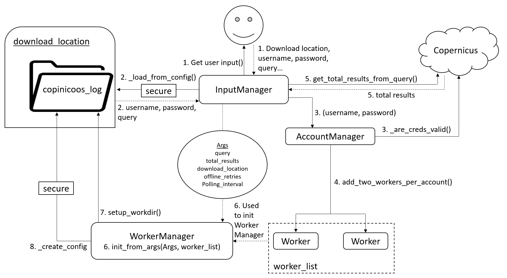

[](https://travis-ci.org/potatowagon/copinicoos)
[](https://codecov.io/gh/potatowagon/copinicoos)

# Copinicoos
<a href="https://scihub.copernicus.eu/dhus/#/home">Copernicus</a>-download manager. Downloads the results in a search query in parallel processes, for faster downloads. Manages polling for offline products.

- [Copinicoos](#copinicoos)
  - [Install](#install)
  - [Usage](#usage)
    - [Interactive Mode](#interactive-mode)
      - [Resume download](#resume-download)
    - [Argparse Mode](#argparse-mode)
      - [resume](#resume)
      - [fresh](#fresh)
      - [For more details:](#for-more-details)
  - [Logs](#logs)
  - [Development](#development)
    - [Architecture](#architecture)
      - [Initialise and Setup](#initialise-and-setup)
    - [Testing](#testing)

## Install

After cloning this repo, cd to root of this repo (where setup.py is) and 
```
pip install .
```
This installs copinicoos into python's site-packages.

## Usage
### Interactive Mode


To launch,
```
py -m copinicoos
```
And then follow on-screen prompt:

1. Enter Download Directory. Where products will be downloaded to. Entering nothing will default to current directory.
   
2. Enter number of Corpernicus accounts. Each account will initialise 2 parallel download processes.
   
3. Authenticate accounts by entering login credentials.
   
4. Enter query. This can be obtained from Copernicus Open Hub `Request Done: ( ... )`. Just copy that whole string.

5. Enter Polling Interval. Entering nothing will use default.

6. Enter offline product download retries. Entering nothing will use default.

#### Resume download


Again, launch 
```
py -m copinicoos
```
And then follow on-screen prompt:

1. Enter download directory containing `copinicoos_logs`. Or, if current working directory has `copinicoos_logs`, entering nothing will resume download from current working directory's savepoint. Savepoints are stored inside `copinicoos_logs`.

2. Agree to resume download 

3. Enter Polling Interval. Entering nothing will use default.

4. Enter offline product download retries. Entering nothing will use default.

### Argparse Mode

This mode is so that copinicoos can be called from a script.

All options:
```
py -m copinicoos <subcommand> -d <download-location> -r <offline-retries> -p <polling-interval>
```
Subcommand:
- resume 

- fresh

#### resume

```
py -m copinicoos resume
```
Resume download from savepoint in current working directory.

```
py -m copinicoos resume -d <download directory>
```
Resume download from savepoint in `<download directory>`.

#### fresh
```
py -m copinicoos fresh <query> <credentials>
```
Start a fresh download. 

Input can be read from a text file by affixing `@` to file name eg.

```
py -m copinicoos fresh @query.txt @secrets.json
```

eg. Inside `query.txt`
```
( footprint:"Intersects(POLYGON((91.45532862800384 22.42016942838278,91.34620270146559 22.43895934481047,91.32598614177974 22.336847270362682,91.4350291249018 22.31804599405974,91.45532862800384 22.42016942838278)))" ) AND ( (platformname:Sentinel-1 AND producttype:GRD))
```

eg. Inside `secrets.json`
```
{
    "u1":"username1",
    "p1":"password1",
    "u2":"username2",
    "p2":"password2"
}
```

Note: `"` has to be escaped, ie `\"`, if parsing directly to the cmd.

#### For more details:
```
py -m copinicoos --help
```

## Logs
Logs can be found in a folder named `copinicoos_logs` in the same directory where products are downloaded to. Manually deleting `copinicoos_logs` will restart the download.

## Development

Source code is in `copinicoos\copinicoos`

cd to where setup.py is and
```
pip install -e .[dev]
```
This installs the dependencies needed for the development environment found under setup.py extras, and runs copinicoos from the dev enviroment, which is to run the code in this repo. All changes are automatically reflected in the dev enviroment. 

### Architecture

#### Initialise and Setup


### Testing

Tests reside in the tests/ folder. Uses pytest framework.

Some unit tests need credentials to run. Due to security reasons, the account credentials used for testing are not commited to git. First, create test data with credentials.

`tests/test_data/secrets1.json`
```
{"u1":"username1","p1":"password1"}
```

`tests/test_data/secrets2.json`
```
{
    "u1":"username1",
    "p1":"password1",
    "u2":"username2",
    "p2":"password2"
}
```

To run all unit test cases
```
pytest -m "not e2e"
```

To run end to end test
```
pytest -m "e2e"
```