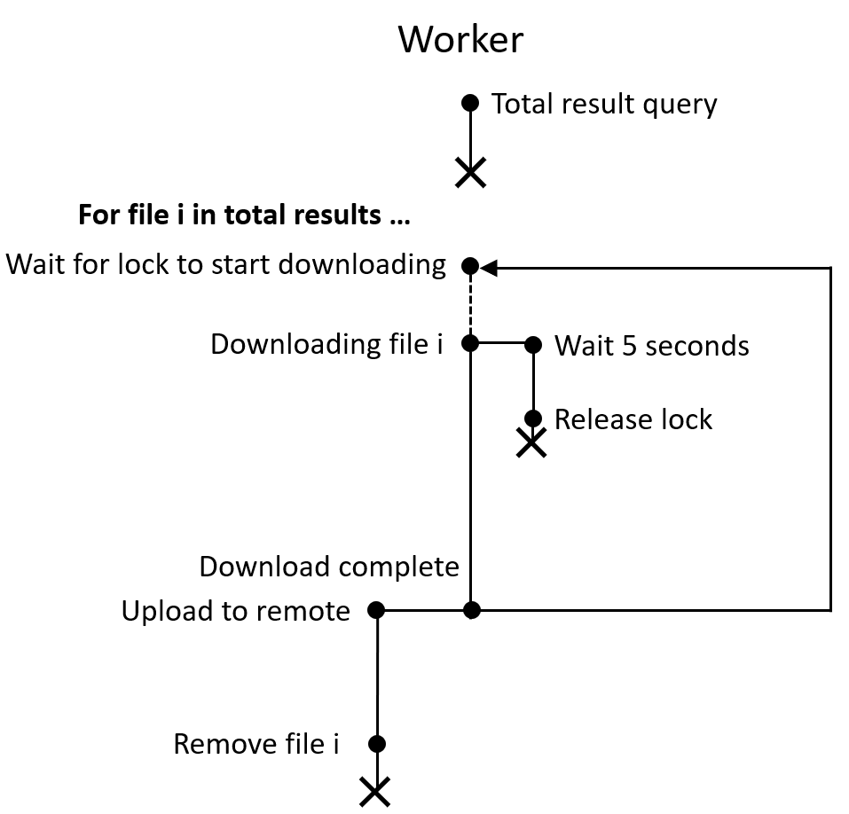
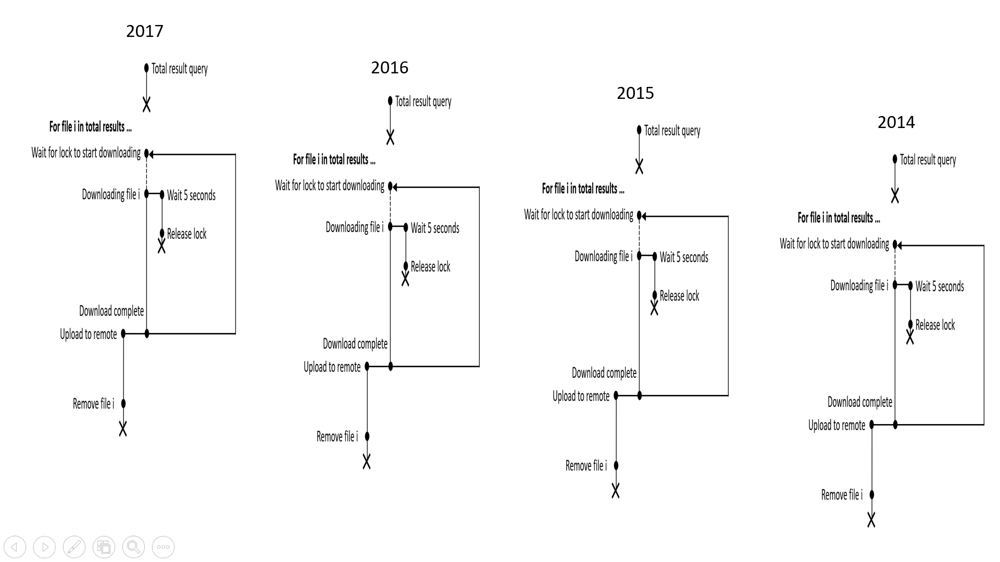

# Copinicoos
Copernicus-downloader. Downloads all the results in a search query in seperate processes, and uploads to a remote repository so Windows users may access it too. The data on local is deleted after it is uploaded to minimise disk usage. Made to run unattended on a server.

- [Copinicoos](#copinicoos)
    + [Why](#why)
    + [How](#how)
    + [Installation](#installation)
    + [Setup](#setup)
      - [Set Remote repository](#set-remote-repository)
      - [Set Copernicus Open Hub accounts](#set-copernicus-open-hub-accounts)
    + [Run](#run)
    + [Retrieving from remote](#retrieving-from-remote)
      - [Github](#github)
      - [Google drive](#google-drive)
    + [Troubleshoot](#troubleshoot)
    
### Why
* Most of the old data are offline. Old data is needed when comparing changes across time. Offline data have to first be made online before download can happen, and this can take anywhere from 20 mins to 24 hours. There is no notification system on Openhub when an offline product is made online. Hence we need a polling system to constantly check and instantly download when a offline product becomes online.

* I need lots of data. Clicking them one by one to download is a pain. 

* Possible to pipe data directly to processing if retrieval of data is automated.

* The API documentation only supports Unix systems. No documented support for Windows. A workaround would be to automate the download to a Unix system, and transfer the files to Windows

### How



Each download process is managed independently by a `Worker` class. Each Worker has its on workdir where files from its query are downloaded to, and its own Copernicus account to authorize with openhub. 
</br></br>
Once a Worker acquires the lock it will start downloading immediately. It holds onto the lock for 5 seconds to ensure only one worker at a time initiates a request with openhub. This is to prevent interference in the initiation which can lead to garbled data. After that the download processes across workers can happen simultaneously. Once data is downloaded it is then uploaded in a seperate thread to a remote (Github or Google Drive). The main loop then process to download the next file.   



In this code 4 Worker instances are initialised to download data from year 2014 to 2017, where each worker is in charge of downloading all data in a particular year. The number i of the i-th downloaded file is saved to progress.txt. When the run resumes or restarts it will read from progress.txt, and continue downloading from the i-th file. You may edit progress.txt to specify a start point of download.

### Installation
First install python. Then clone or download (.zip) this repository. Runs only on Unix systems, ie. Linux and Mac
```
git clone https://github.com/potatowagon/copinicoos.git
```

### Setup 
cd to cloned repository, and give run access to the setup script
```
chmod +x setup.sh
./setup.sh
```

#### Set Remote repository
The git repository where downloaded data will be uploaded to.
```
git remote add data <my remote repository>
```

#### Set Copernicus Open Hub accounts
This bot uses 4 Copernicus open hub accounts to download 4 items simultaneously. An empty `secrets.py` file has been created during the setup phase. Please fill in the following in secrets.py

```
worker1_username = "fill in username"
worker1_password = "fill in password"

worker2_username = "fill in username"
worker2_password = "fill in password"

worker3_username = "fill in username"
worker3_password = "fill in password"

worker4_username = "fill in username"
worker4_password = "fill in password"

```

### Run
Edit `main.py` to adjust search query. For examaple, `lonlat` sepcifies query location, `start_date` and `end_date` specifies query sensing time window.

To run
```
python main.py
```

### Retrieving from remote

#### Github
```
git pull data 
```

#### Google drive 
Script coming soon

### Troubleshoot

If you see the system spitting out concurrent downloading request without downloading that looks something like this

```
morocco/2017/dhusget.sh -u copinicoos2 -p sondra11 -T GRD -m "Sentinel-1" -c "-6.117176708154047,35.429154357361384:-5.998938062810441,35.579892441113685" -S 2017-01-01T00:00:00.000Z -E 2017-12-31T23:59:59.000Z -l 1 -P 1 -o product -O morocco/2017 -w 5 -W 30 -L morocco/2017/dhusget_lock -n 4 -q morocco/2017/OSquery-result.xml -C morocco/2017/products-list.csv
morocco/2017/dhusget.sh -u copinicoos2 -p sondra11 -T GRD -m "Sentinel-1" -c "-6.117176708154047,35.429154357361384:-5.998938062810441,35.579892441113685" -S 2017-01-01T00:00:00.000Z -E 2017-12-31T23:59:59.000Z -l 1 -P 2 -o product -O morocco/2017 -w 5 -W 30 -L morocco/2017/dhusget_lock -n 4 -q morocco/2017/OSquery-result.xml -C morocco/2017/products-list.csv
morocco/2017/dhusget.sh -u copinicoos2 -p sondra11 -T GRD -m "Sentinel-1" -c "-6.117176708154047,35.429154357361384:-5.998938062810441,35.579892441113685" -S 2017-01-01T00:00:00.000Z -E 2017-12-31T23:59:59.000Z -l 1 -P 3 -o product -O morocco/2017 -w 5 -W 30 -L morocco/2017/dhusget_lock -n 4 -q morocco/2017/OSquery-result.xml -C morocco/2017/products-list.csv
morocco/2017/dhusget.sh -u copinicoos2 -p sondra11 -T GRD -m "Sentinel-1" -c "-6.117176708154047,35.429154357361384:-5.998938062810441,35.579892441113685" -S 2017-01-01T00:00:00.000Z -E 2017-12-31T23:59:59.000Z -l 1 -P 4 -o product -O morocco/2017 -w 5 -W 30 -L morocco/2017/dhusget_lock -n 4 -q morocco/2017/OSquery-result.xml -C morocco/2017/products-list.csv
...
```
It is highly likely because the lock folder `dhusget_lock` was not deleted due to sudden termination of a previous run.

To resolve delete all `dhusget_lock` folders

```
find . -name dhusget_lock -type d -exec rm -r {} +
```

Error logs can be found in `worker_log.txt` and `upload_log.txt` in workdir of each Worker

``` 
cat ./path/to/workdir/worker_log.txt
```
