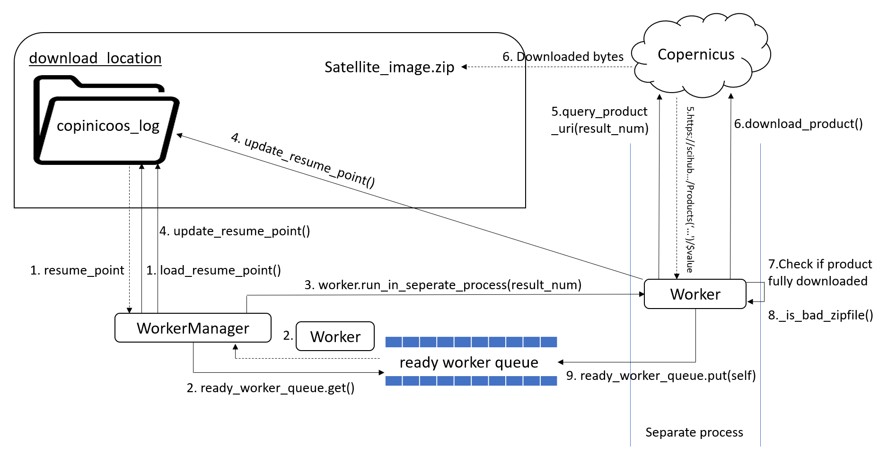

[](https://travis-ci.org/potatowagon/copinicoos)
[](https://codecov.io/gh/potatowagon/copinicoos)
[](https://pypi.org/project/copinicoos/)
[](https://pypi.org/project/copinicoos/)
[](https://travis-ci.org/potatowagon/copinicoos)
[](https://github.com/potatowagon/copinicoos/blob/master/LICENSE) 
[](https://gitter.im/copinicoos/community?utm_source=badge&utm_medium=badge&utm_campaign=pr-badge&utm_content=badge)

# Copinicoos
Copinicoos is a <a href="https://scihub.copernicus.eu/dhus/#/home">Copernicus</a> satellite image download manager. 

Copinicoos can ...
1. Automate the download of all results in a search query. 
2. Download in parallel processes, for faster downloads. 
3. Manage polling for offline products. 
4. Stop and resume downloads, anytime!

- [Copinicoos](#copinicoos)
  - [Install](#install)
  - [Usage](#usage)
    - [Interactive Mode](#interactive-mode)
      - [Resume download](#resume-download)
    - [Argparse Mode](#argparse-mode)
      - [resume](#resume)
      - [fresh](#fresh)
      - [For more details:](#for-more-details)
  - [Logs](#logs)
  - [Development](#development)
    - [Architecture](#architecture)
      - [Initialise and Setup](#initialise-and-setup)
      - [Running workers](#running-workers)
    - [Testing](#testing)

## Install

```
pip install copinicoos
```

## Usage
### Interactive Mode


To launch,
```
py -m copinicoos
```
And then follow on-screen prompt:

1. Enter Download Directory. Where products will be downloaded to. Entering nothing will default to current directory.
   
2. Enter number of Corpernicus accounts. Each account will initialise 2 parallel download processes.
   
3. Authenticate accounts by entering login credentials.
   
4. Enter query. This can be obtained from Copernicus Open Hub `Request Done: ( ... )`. Just copy that whole string.

5. Enter Polling Interval. Entering nothing will use default of one poll every 30 mins.

6. Enter offline product download retries. Entering nothing will use default of 24 retries. That is half a day's grace (for default polling interval of 30 mins) for the product to be online before moving on to the next product. 

#### Resume download


Again, launch 
```
py -m copinicoos
```
And then follow on-screen prompt:

1. Enter download directory containing `copinicoos_logs`. Or, if current working directory has `copinicoos_logs`, entering nothing will resume download from current working directory's savepoint. Savepoints are stored inside `copinicoos_logs`.

2. Agree to resume download 

3. Enter Polling Interval. Entering nothing will use default.

4. Enter offline product download retries. Entering nothing will use default.

### Argparse Mode

This mode is so that copinicoos can be called from a script.

All options:
```
py -m copinicoos <subcommand> -d <download-location> -r <offline-retries> -p <polling-interval>
```
Subcommand:
- resume 

- fresh

When any of the optional options: `-d`, `-r`, `-p` are omitted copinicoos will fall back to using default values.

Default values are
```
-d, --download-location : the current working directory
-r, --offline-retries : 24 retries
-p, --polling-interval : 1800 seconds, or 30 mins
```

#### resume

```
py -m copinicoos resume
```
Resume download from savepoint in current working directory.

```
py -m copinicoos resume -d <download directory>
```
Resume download from savepoint in `<download directory>`.

#### fresh
```
py -m copinicoos fresh <query> <credentials>
```
Start a fresh download. 

Input can be read from a text file by affixing `@` to file name eg.

```
py -m copinicoos fresh @query.txt @secrets.json
```

eg. Inside `query.txt`
```
( footprint:"Intersects(POLYGON((91.45532862800384 22.42016942838278,91.34620270146559 22.43895934481047,91.32598614177974 22.336847270362682,91.4350291249018 22.31804599405974,91.45532862800384 22.42016942838278)))" ) AND ( (platformname:Sentinel-1 AND producttype:GRD))
```

eg. Inside `secrets.json`
```
{
    "u1":"username1",
    "p1":"password1",
    "u2":"username2",
    "p2":"password2"
}
```

Note: `"` has to be escaped, ie `\"`, if parsing directly to the cmd.

#### For more details:
```
py -m copinicoos --help
```

## Logs
Logs can be found in a folder named `copinicoos_logs` in the same directory where products are downloaded to. Manually deleting `copinicoos_logs` will restart the download.

A summary of finished downloads can be found in `copinicoos_logs\WorkerManager.log`. You can check the download status (`SUCCESS`, `FAILED` or `OFFLINE`) of each product in this log file.

Resume points are saved in `<InstanceName>_progress.txt`


## Development
Clone the repository.
```
git clone https://github.com/potatowagon/copinicoos.git
```

cd to where setup.py is and
```
pip install -e .[dev]
```
This installs the dependencies needed for the development environment found under setup.py extras, and runs copinicoos from the dev enviroment, which is to run the code in this repo. All changes are automatically reflected in the dev enviroment. 

Source code is in `copinicoos\copinicoos`

### Architecture

#### Initialise and Setup


Note: Step 2. only happens in resume mode.

#### Running workers


Steps 2. to 9. repeat until all result numbers in the search query have been assigned to a worker.

### Testing

Tests reside in the tests/ folder. Uses pytest framework.

Some unit tests need credentials to run. Due to security reasons, the account credentials used for testing are not commited to git. First, create test data with credentials.

`tests/test_data/secrets1.json`
```
{"u1":"username1","p1":"password1"}
```

`tests/test_data/secrets2.json`
```
{
    "u1":"username1",
    "p1":"password1",
    "u2":"username2",
    "p2":"password2"
}
```

To run all unit test cases
```
pytest -m "not e2e"
```

To run end to end test
```
pytest -m "e2e"
```
